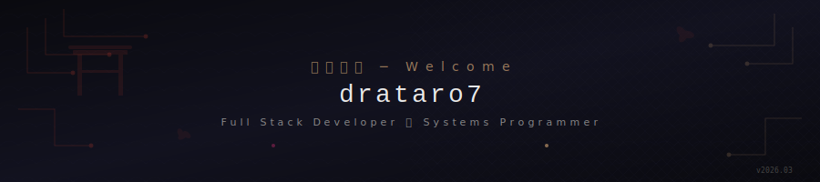
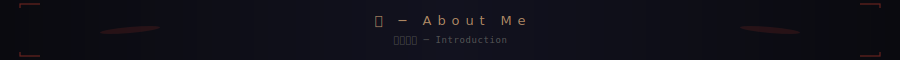
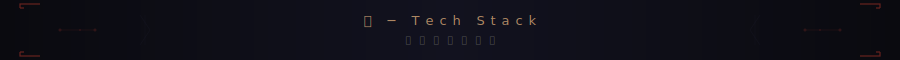
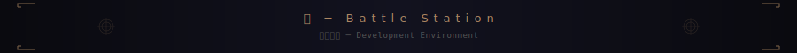
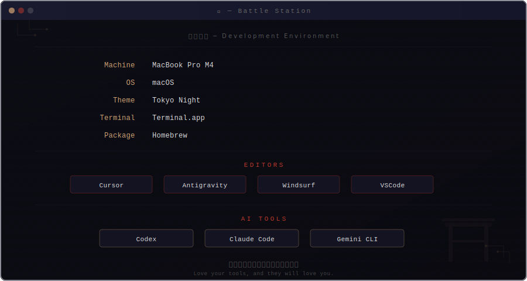
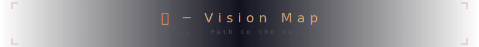
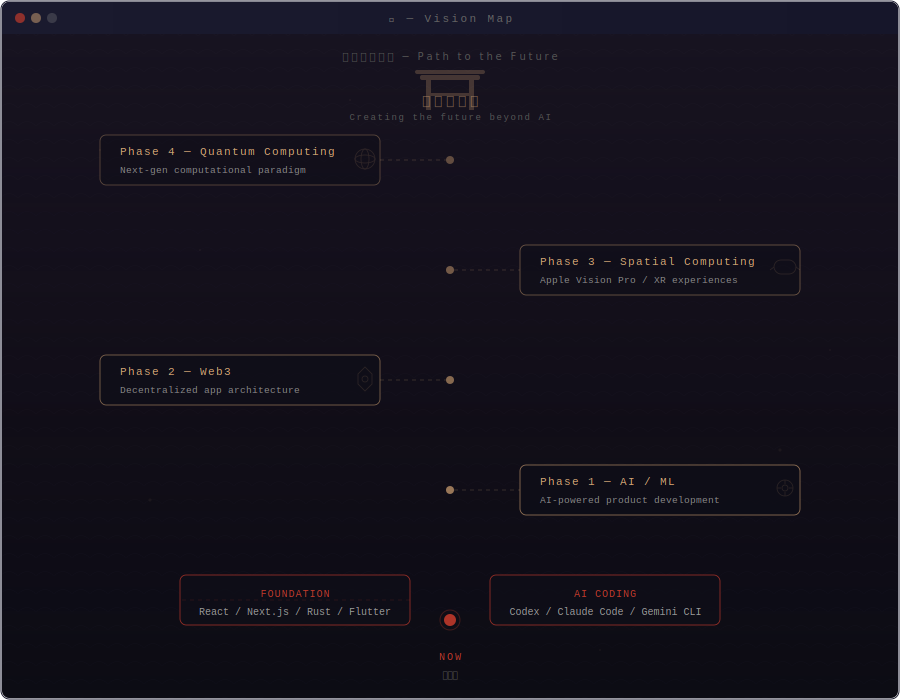
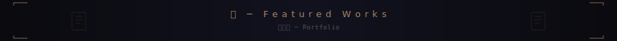
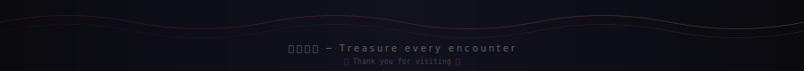

  

 

  &nbsp;
  &nbsp;
  &nbsp;
  &nbsp;
  

 

  

 

<!-- ━━━━━━━━━━━━━━━━ 己 ─ About Me ━━━━━━━━━━━━━━━━ -->

  

 

<table align="center">
<tr>
<td width="50%" align="center" valign="top">

</td>
<td width="50%" valign="top">

 

**道 ─ My Path**

Web とシステムの境界を行き来する開発者。 
パフォーマンスへの探求心が原動力。

A developer bridging web and systems. 
Driven by the pursuit of performance.

 

> *「速さは正義、美しさは武器」*
> 
> *Speed is justice, beauty is a weapon.*

 

🦀 Rustacean &nbsp; ⚡ Performance-first

🌱 Lifelong learner &nbsp; ☕ Coffee-powered

</td>
</tr>
</table>

 

  

 

<!-- ━━━━━━━━━━━━━━━━ 技 ─ Tech Stack ━━━━━━━━━━━━━━━━ -->

  

 

<!-- Row 1: 壱 弐 参 -->

<table>
<tr>
<td align="center" width="33%">

**壱 Web**

</td>
<td align="center" width="33%">

**弐 Systems**

</td>
<td align="center" width="33%">

**参 Mobile**

</td>
</tr>
<tr>
<td align="center" valign="top">

</td>
<td align="center" valign="top">

</td>
<td align="center" valign="top">

</td>
</tr>
</table>

<!-- Row 2: 肆 伍 陸 -->

<table>
<tr>
<td align="center" width="33%">

**肆 Backend**

</td>
<td align="center" width="33%">

**伍 AI / ML**

</td>
<td align="center" width="33%">

**陸 DevOps**

</td>
</tr>
<tr>
<td align="center" valign="top">

</td>
<td align="center" valign="top">

</td>
<td align="center" valign="top">

</td>
</tr>
</table>

<!-- Row 3: 漆 -->

<table>
<tr>
<td align="center" width="100%">

**漆 Tools**

</td>
</tr>
<tr>
<td align="center">

&nbsp;
&nbsp;
&nbsp;

</td>
</tr>
</table>

 

  

 

<!-- ━━━━━━━━━━━━━━━━ 陣 ─ Battle Station ━━━━━━━━━━━━━━━━ -->

  

 

  

 

  

 

<!-- ━━━━━━━━━━━━━━━━ 志 ─ Vision Map ━━━━━━━━━━━━━━━━ -->

  

 

  

 

  

 

<!-- ━━━━━━━━━━━━━━━━ 作 ─ Featured Works ━━━━━━━━━━━━━━━━ -->

  

 

<table>
<tr>
<td width="50%" valign="top">

<h3 align="center">🌐 Project Name 1</h3>

Next.js Full-Stack Application

Server-side rendering ・ Auth system 
Real-time analytics ・ Modern UI/UX

  

</td>
<td width="50%" valign="top">

<h3 align="center">🦀 Project Name 2</h3>

Rust CLI Tool

High performance ・ System integration 
Cross-platform ・ Zero-cost abstractions

  

</td>
</tr>
</table>

 

<!-- ━━━━━━━━━━━━━━━━ Footer ━━━━━━━━━━━━━━━━ -->

If you find my work useful ─ 応援よろしくお願いします ☕

 

  

